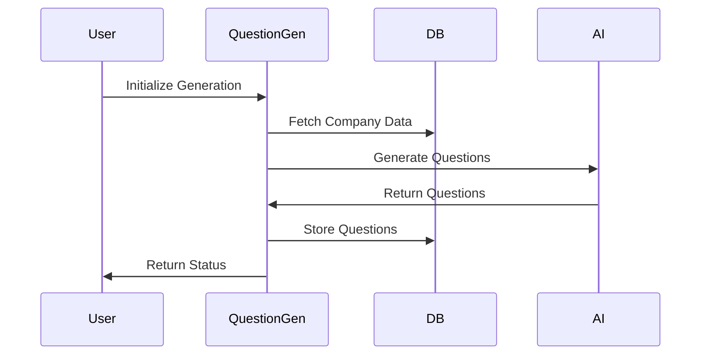
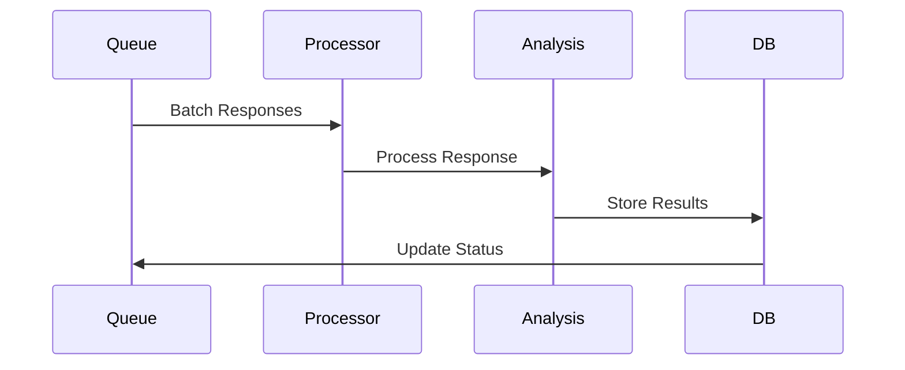

# System Architecture Overview

## System Components

### 1. Data Generation Layer
- **Company Management**
  - Company profile creation and management
  - ICP generation and management
  - Competitor relationship mapping

- **Question Generation**
  - Template-based question generation
  - Context-aware prompting system
  - Multi-phase question targeting

### 2. Processing Layer
- **Response Processing**
  - Queue-based processing system
  - Batch processing capabilities
  - Error handling and retry mechanisms

- **Analysis Engine**
  - Sentiment analysis
  - Ranking extraction
  - Citation processing
  - Geographic and industry analysis

### 3. Storage Layer
- **Database**
  - Supabase PostgreSQL database
  - Real-time capabilities
  - Complex relationships

- **Caching**
  - Response caching
  - Analysis result caching
  - Query optimization

## Component Interactions

### Question Generation Flow

### Response Processing Flow

## Key Technologies

### Frontend
- Next.js App Router
- React Server Components
- Shadcn UI Components
- Tailwind CSS

### Backend
- TypeScript
- Supabase
- PostgreSQL
- AI APIs (OpenAI, Anthropic, Google)

### Processing
- Queue-based processing
- Batch analysis
- Real-time updates

## Security Considerations

### Authentication
- Supabase authentication
- Role-based access control
- API key management

### Data Protection
- Environment variable security
- API rate limiting
- Data encryption

## Performance Optimizations

### Response Processing
- Batch processing
- Concurrent request handling
- Queue management

### Database
- Index optimization
- Query optimization
- Connection pooling

## Monitoring and Logging

### System Monitoring
- Response processing metrics
- Queue status monitoring
- Error tracking

### Performance Metrics
- Processing times
- API response times
- Database query performance

## Deployment Architecture

### Production Environment
- Vercel deployment
- Supabase database
- Environment configuration

### Development Environment
- Local development setup
- Testing environment
- Staging configuration 